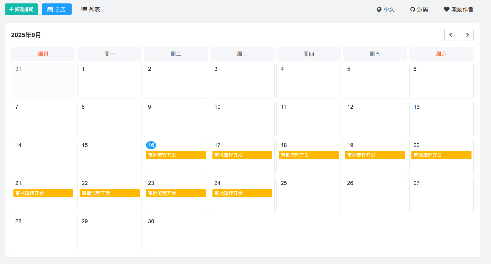

## 以下为工具截图

## 以下为项目介绍
* 项目为纯前端, 数据保存在localstorage。
* 工具地址: [https://scheduling-tool.netlify.app/](https://scheduling-tool.netlify.app/)

## 赞助支持

如果这个项目对您有所帮助，请考虑赞助支持一下。您的支持是我持续更新的动力！

| 支付宝 | 微信支付 |
| :----: | :------: |
|  |  |

**感谢以下赞助者的支持！**

